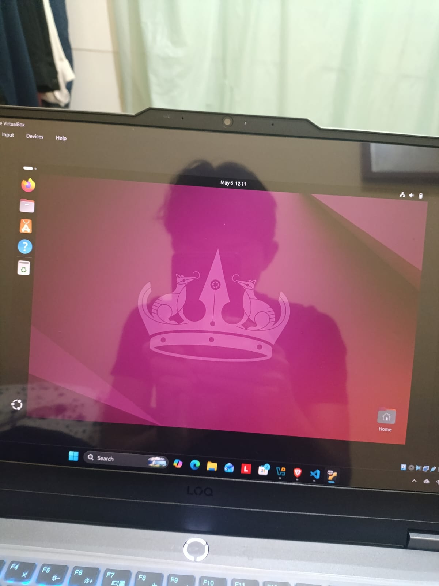
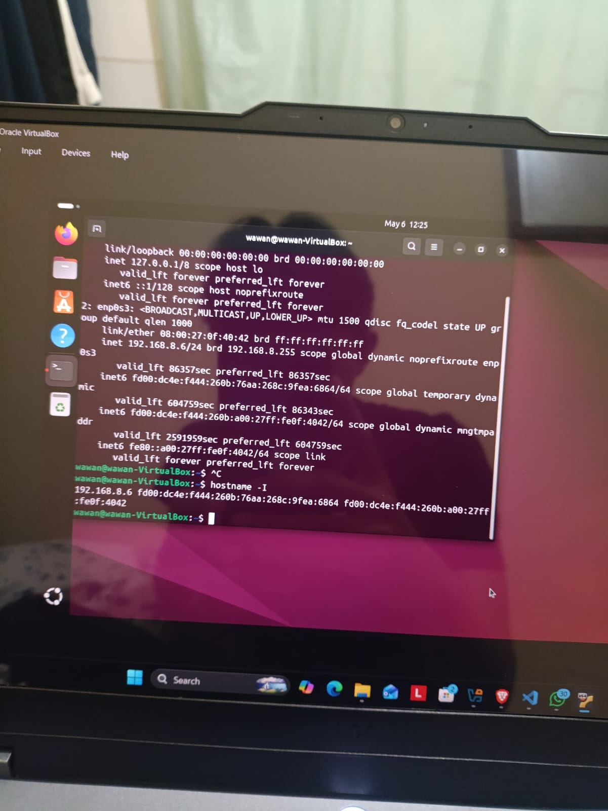

# Apa itu DevOps?

Jadi DevOps itu singkatan dari development dan operation, yakni
alur dari plan, code, build, text yaitu ranah developer lalu
lanjut alur ke release, deploy, operate, hingga monitor yaitu ranah operation.

Jadi menurut saya DevOps adalah suatu lifesycle dari development hingga operation yang dimana
DevOps berperan agar lifesycle tersebut dapat diotomatisasi sehingga dapat mempercepat proses
development, menurunkan tingkat kegagalan, hingga mempersingkat waktu perbaikan development dan operation.

---

# Instalasi Ubuntu

1. Download virtual machine Oracle terlebih dahulu pada link https://www.virtualbox.org/wiki/Downloads.
2. Download Ubuntu pada link https://ubuntu.com/download
3. Setelah download keduanya, lakukan create new folder pada virtual machine Oracle untuk
menyimpan file Ubuntu pada virtual machine Oracle.
4. Mengisi nama, folder sesuai dengan file ubuntunya simpan dimana, mengisi type, subtype, version Ubuntunya.
5. Lalu ke option hardware untuk mengatur berapa memori yang digunakna untuk menyimpan Ubuntunya.
6. Laku ke opsi hardist untuk menyimpan seberapa besar penyimpanan yang digunakna untuk menjalnakan ubuntunya
pada vm tersebut.
7. Klik start untuk menjalankan vm mengaktifkan ubuntu.
8. Saat mau mulai ada grab terminal ada terdapat beberapa opsi, langsung pilih ubuntu saja.
9. Setelah itu ikut intstruksi dari ubuntunya seperti mengisi nama, password, pengaturan file ubuntu,
dll sampai selesai.
10. Jika sudah selesai maka hasilnya akan seperti ini:

