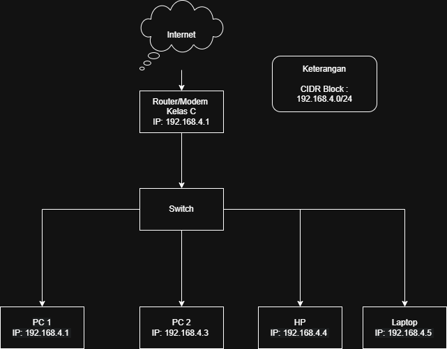
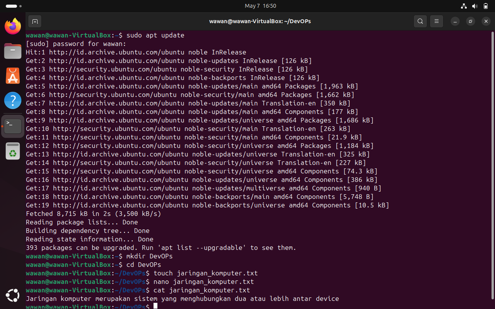
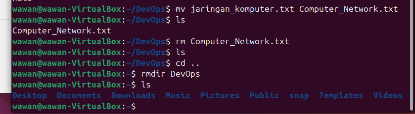
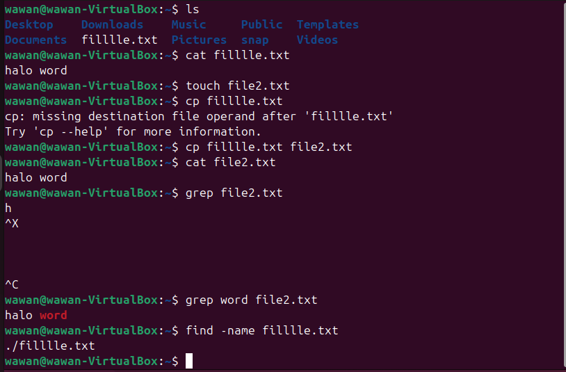

# DAY-2

STAGE-1
---------
Task Completion

# 1. Diagram dengan jaringan komputer dengan 4 device

---

# 2. Perbedaan antara SH(Shell) dan BASH (Bourne-Again Shell)

Perbedaan paling utama adalah SH itu masih basic/dasarnya, sedangkan BASH lebih banyak
fitur-fiturnya, berikut beberapa perbedaan dari SH dan BASH

1. Asal usulnya: SH itu shell asli unix, sementara BASH yakni peningkatan dari versi sh.
2. Sintaks: SH sinktkasnya sederhana, sementara BASH lebih canggih, ramah pengguna, dan
menyediakan banyak fungsi script.
3. Kompabilitas: SH dirancang supaya sesuai dengan unix, sementara bash dirancang supaya
lebih sesuai dengan sistem yang lebih modern.

Kesimpulannya sebagian besaar skrip SH bisa berjalan di bash, tetapi skrip yang ada di bash
belum tentu dapat berjalan di SH.
---

## 3. Dokumentasi/kumpulan command linux

1. mkdir DevOps : Membuat folder DevOps
2. cd DevOps : Pindah masuk ke folder DevOps
3. touch jaringan_komputer.txt : Buat file jaringan_komputer.txt
4. nano jaringan_komputer.txt : Edit isi file jaringan_komputer.txt
5. cat tugas.txt : Melihat isi jaringan_komputer.txt

---------

6. mv jaringan_komputer.txt Computer_Network.txt : Mengganti nama file
jaringan_komputer.txt jadi Computer_Network.txt.

7. rm Computer_Network.txt: Menghapus file Computer_Network.txt.
8. cd .. : Keluar dari folder DevOps.
9. rmdir DevOps : Menghapus folder DevOps.
10. ls :  Melihat Lihat isi folder.
11. pwd :  Mengetahui posisi saat ini lagi di folder mana.

---------

12. cp filllle.txt file2.txt : Mengcopy isi yang ada di filllle.txt ke file2.txt
13. grep word file2.txt :  Mencari kata kunci dari file2.txt
14. find -name filllle.txt: Mencari nama file filllle.txt

---------

15. echo halo word > filllle.txt : menampilkan sekaligus menulis text di filllle.txt

---------

16. chmod +x file2.txt: Mengubah izin file.txt menjadi boleh dijalankan

