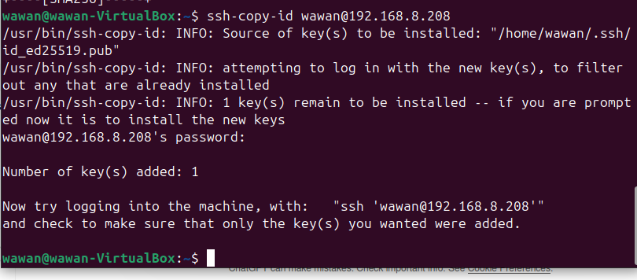
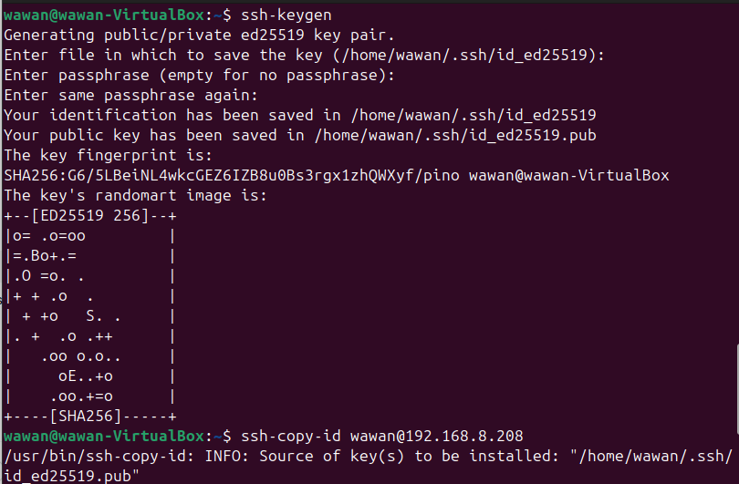
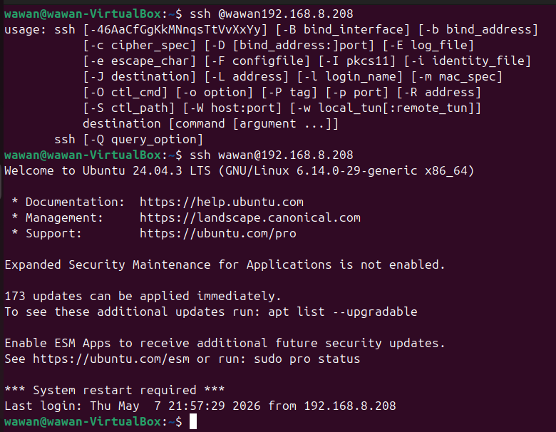
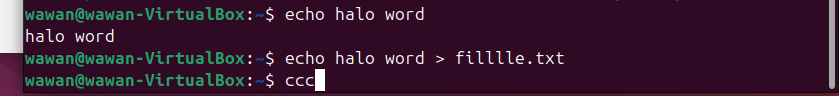
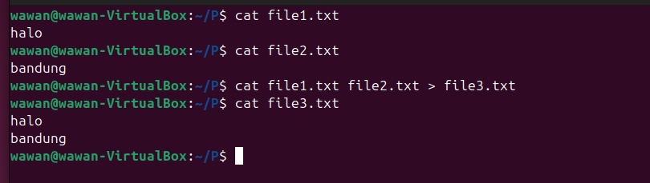
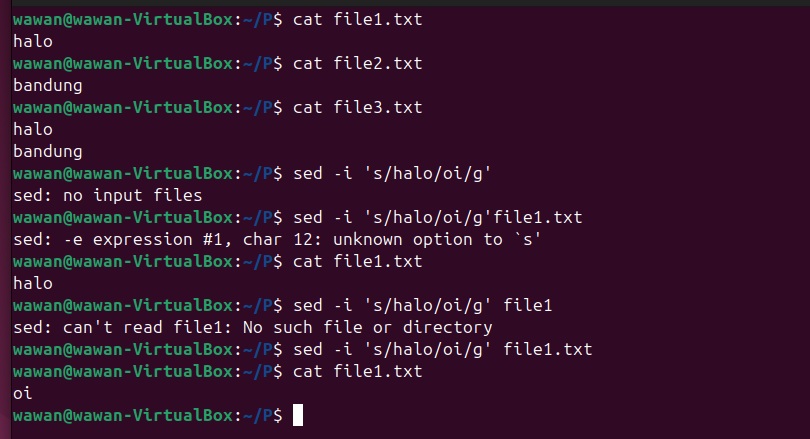
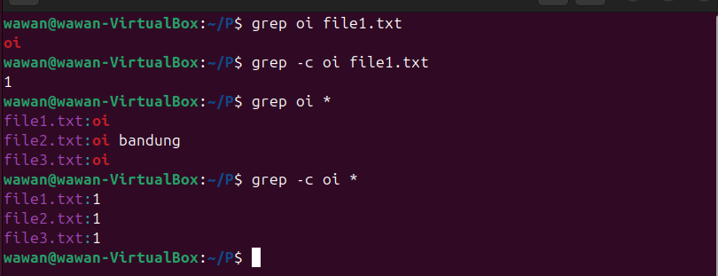
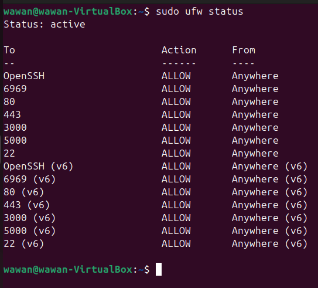

# DAY-3

STAGE-1
---------
Task Completion

# 1. Akses terminal

Akses terminalnya ini menggunakan GNOME terminal dari ubuntu

---

# 2. Konfigurasi ssh hanya diakses dengan publickey

1. ssh keygen: membuat pasangan publickey dan privatekey.

---

2. ssh-copy-id wawan@192.168.8.208 : Mengirim publickey dari client ke server 
agar dapat masuk ssh tanpa password
3. number of keys added 1: Membuktikan bahwa 1 publickey berhasil 
masuk ke server pada file authorized_key. 

---

4. ssh wawan@192.168.8.208: Masuk ke ssh, hasilnya berhasil masuknya hanya dengan
publickey tanpa mengisi password.

---

## 3. Step by step penggunaan text manipulation (grep, sed, cat, echo)

1. echo
- echo halo word > menampilkan kembali apa yang ditulis
- echo halo word > filllle.txt : menampilkan sekaligus menulis text di filllle.txt

---------

2. cat
- cat file1.txt: lihat isi file1
- cat file2.txt: lihat isi file2
- cat file1.txt > file2.txt: menyisipkan isi dari 2 file tersebut ke file3
- cat file3.txt: isi file3 tersebut gabungan dari isi file1 dan file2.

---------

3. sed
- sed -i 's/halo/oi/g' file1.txt: menggantikan kata halo jadi oi pada file1.txt
- cat file1.txt: hasilnya yang awalnya kata halo jadi oi

---------

4. grep
- grep oi file1.txt: mencari kata kunci oi pada file1.txt
- grep -c oi file1.txt: menghitung ada berapa line pada kata oi di file1.txt
- grep oi *: mencari kata kunci oi pada seluruh file yang ada
- grep -c oi *: menghitung ada berapa line pada kata oi di seluruh file yang ada

---------

## 4. UFW memberikan akses terhadap port 22, 80, 443, 3000, 5000 dan 6969

1. Memberikan akses port
- sudo ufw allow 22
- sudo ufw allow 80
- sudo ufw allow 443
- sudo ufw allow 3000
- sudo ufw allow 5000
- sudo ufw allow 6969

2. Melihat status ufw 
- sudo ufw status

