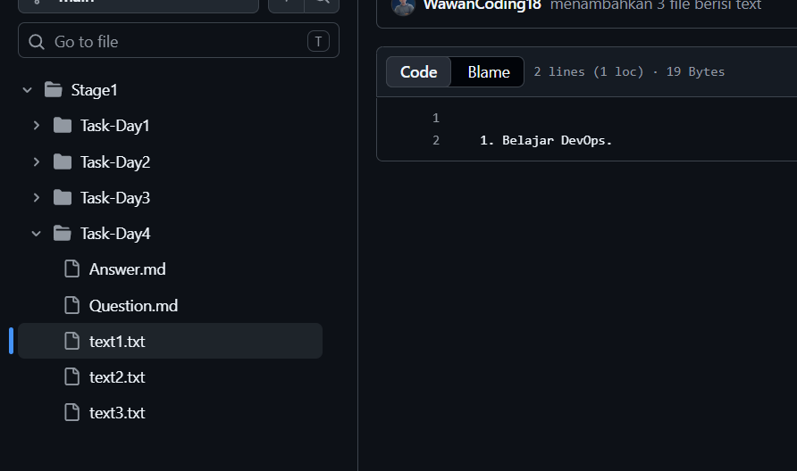
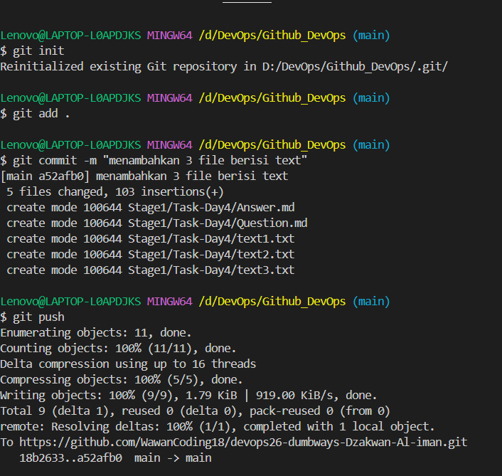
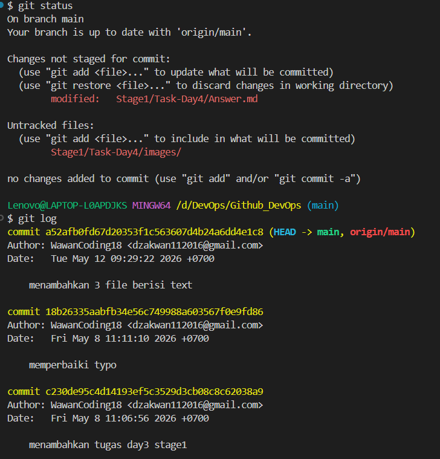
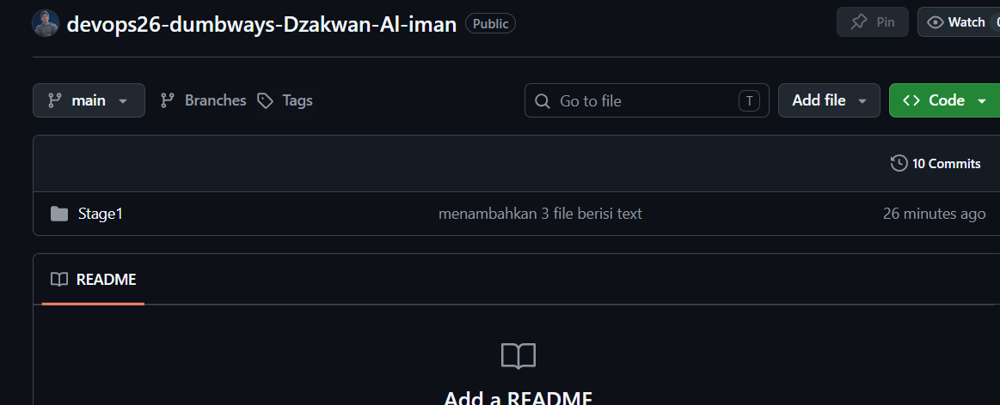
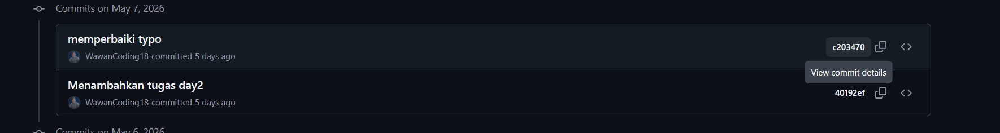
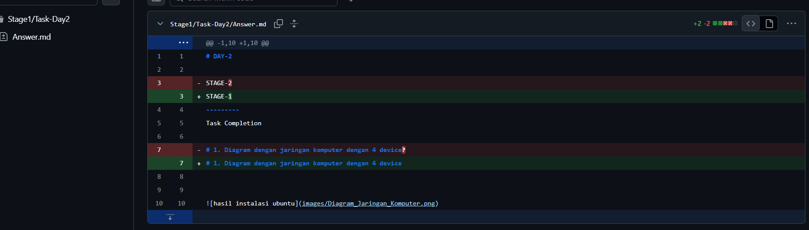
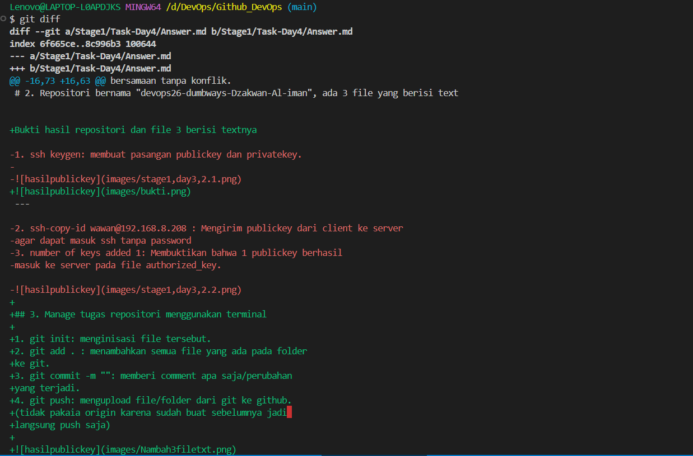
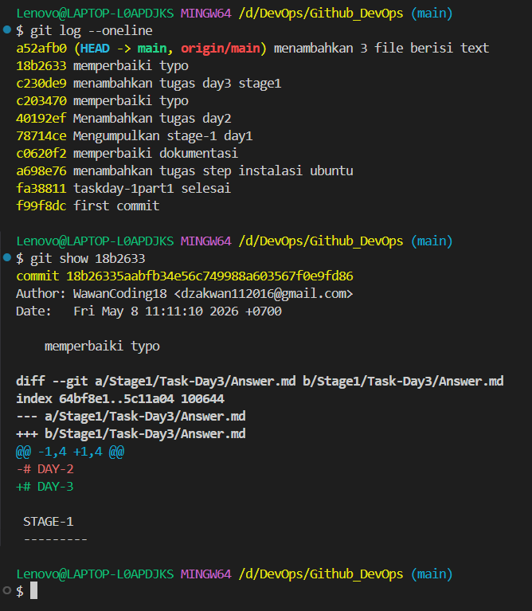

# DAY-4

STAGE-1
---------
Task Completion

# 1. Apa itu GIT?

Menurut saya GIT adalah sebuah sistem kontrol yang dirancang untuk melacak
perubahan pada source code selama sistem development. Git bertujuan agar
developer dapat mengelola file dengan realtime, berkolaborasi dalam tim secara
efektif, dan memungkinkan para developer untuk mengerjakan proyek yang sama secara
bersamaan tanpa konflik.

# 2. Repositori bernama "devops26-dumbways-Dzakwan-Al-iman", ada 3 file yang berisi text

Bukti hasil repositori dan file 3 berisi textnya

---

## 3. Manage tugas repositori menggunakan terminal

1. git init: menginisasi file tersebut.
2. git add . : menambahkan semua file yang ada pada folder
ke git.
3. git commit -m "": memberi comment apa saja/perubahan
yang terjadi.
4. git push: mengupload file/folder dari git ke github.
(tidak pakaia origin karena sudah buat sebelumnya jadi 
langsung push saja)

---

5. git status: Melihat status perubahan pada file/folder.
6. git log: Melihat commit yang sudah dilakukan apa aja 
berdasarkan tgl.

---

7. Git clone: mengambil data pertama kali dari github ke local

---------

## 4. Mencari perubahan text pada suatu file di GitHub!

1. Mencari perubahan text langsung dari web Githubnya
- Pada home repositori pencet commits

---

- Pencet id atau pesan yang ingin dilihat

---

- Tanda merah menandakan tulisan itu telah diganti,
sedangkan yang tanda hijau menandakan tulisannya
itu yang terbaru

---

2. Mencari perubahan text langsung dari terminal (Yang baru di edit, belum ke add ke github)
-git diff: menampilkan perubahan text, yang warna merah 
tulisan itu telah diganti, sedangkan yang tanda hijau menandakan tulisannya
itu yang terbaru

---

3. Mencari perubahan text langsung dari terminal (Yang sudah di push ke github)
- git log --oneline: Untuk membuka id-id commitnya
- git show id : Untuk melihat perubahan berdasarkan commit idnya

---

