# DAY-5

STAGE-1
---------
Task Completion

# 1. Deploy dengan Node.js

1. git clone https://github.com/dumbwaysdev/dumbflix-frontend:
mengirim data pertama kali dari github ke local

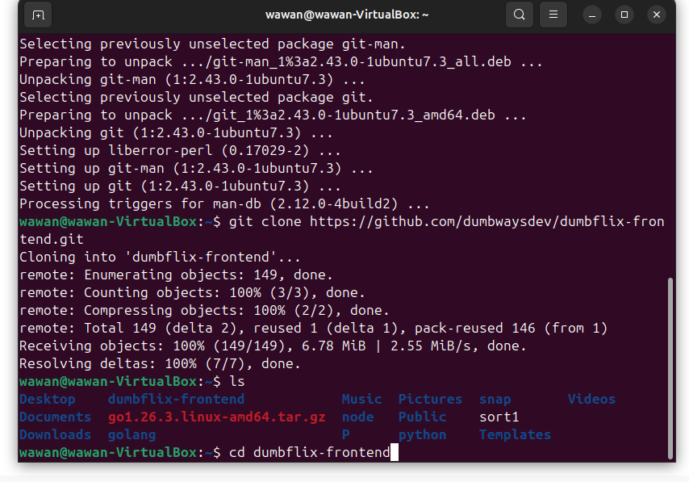
---

2. nvm install 12: menginstall node js versi 12

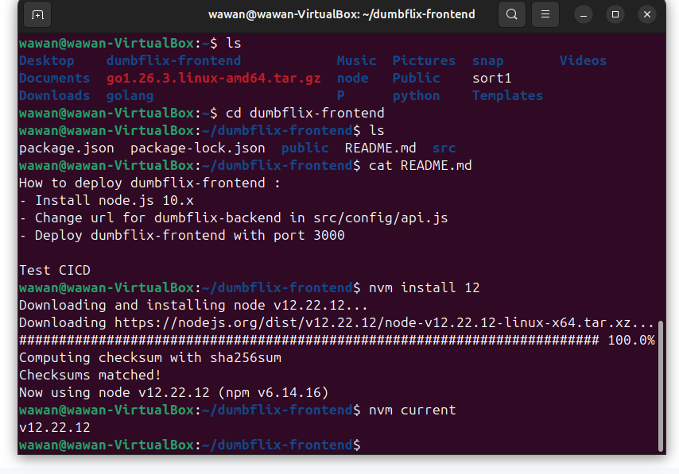
---

3. npm install: menginstal node package manager

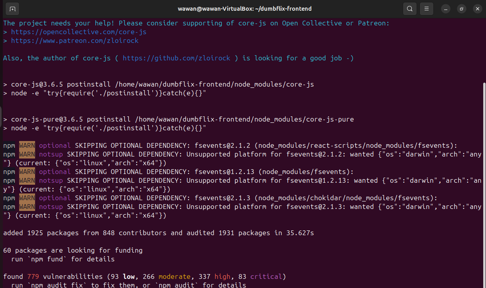
---

4. npm start: menjalankan webnya dengan masih mode
development

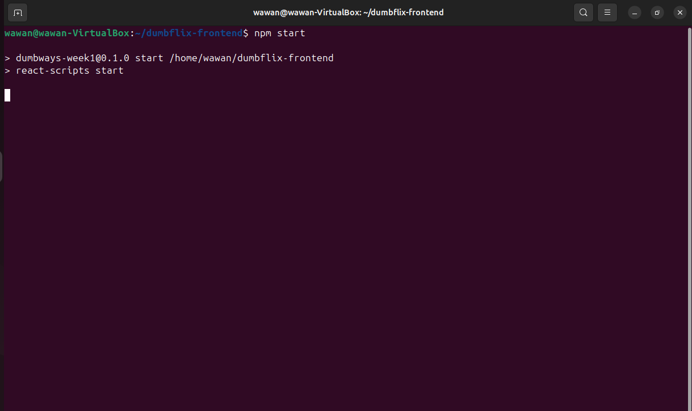
---

5. Hasil

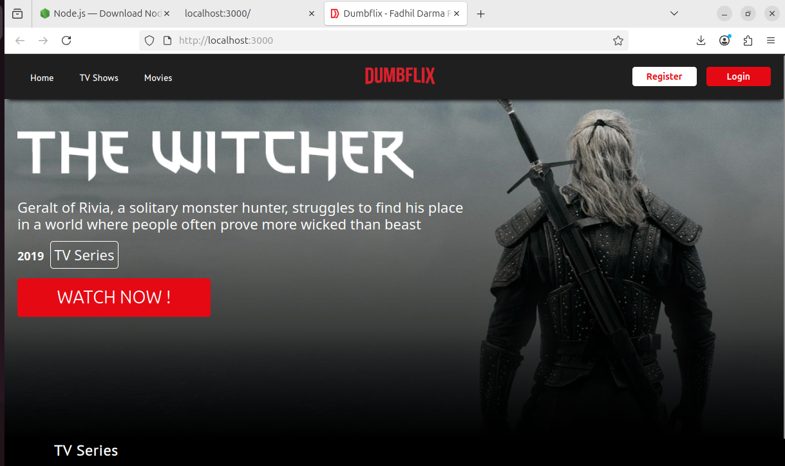
---

6. Terbukti port 3000 sudah terakses dengan UFW enabled

---

# 2. Deploy dengan Python

1. python3 -V: mengecek versi python yang kita punya.
2. sudo apt install python3-pip: download pythonnya melalui
pip.
3. pip -V: mengecek versi dari pipnya

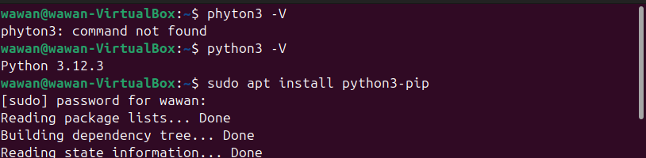
---

4. pip install flask: Download framework python
flask dengan pip.

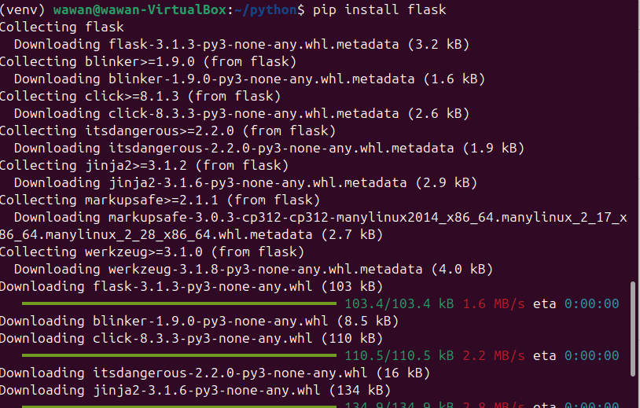
---

5. nano index.py: Menambahkan file tersebut
dengan codingan agar dapat menerima port
5000 pada browsernya

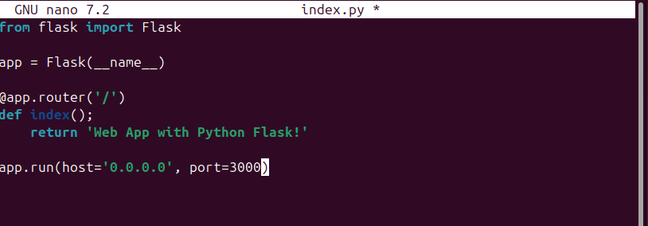
---

6. python3 index.py: menjalankan program pythonnya
dan mengatifkan server sehingga dapat nyambung ke
port 5000 dan muncul di browser nama saya

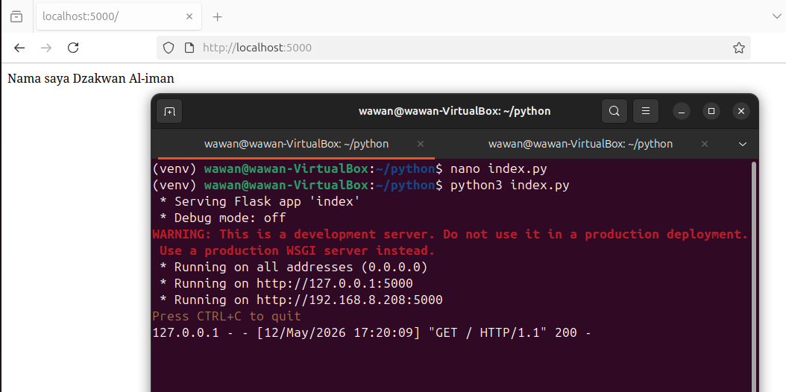
---

7. Terbukti port 5000 sudah terakses dengan UFW enabled

---

## 3. Deploy dengan Golang

1. #get go1.26.3.linux-amd64.tar.gz: Mempersiapkan untuk file golang ke linuxnya
2.  rm -rf /usr/local/go && tar -C /usr/local -xzf go1.26.3.linux-amd64.tar.gz:
mendownload golang dan menyimpan pada local filenya.

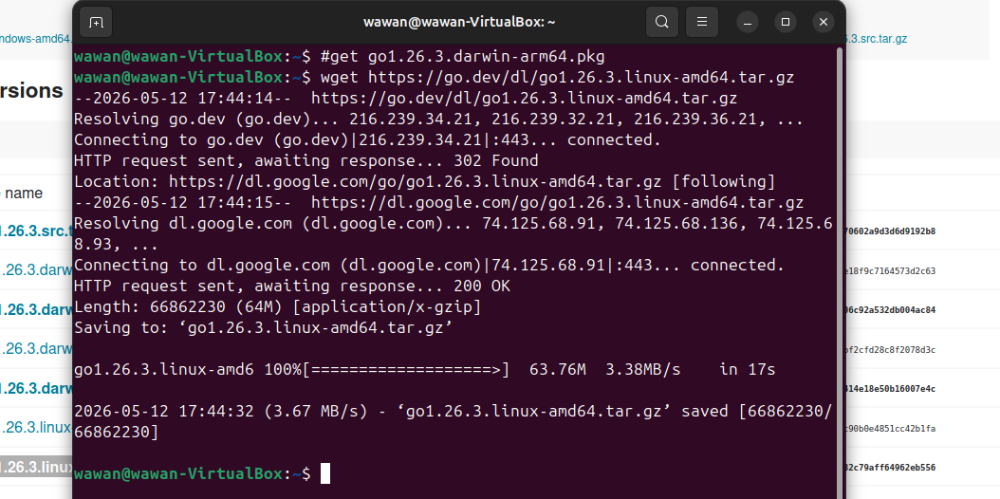
---

3. export PATH=$PATH:/usr/local/go/bin: Untum mengexport golang
pada local filenya.
4. go version: Mengecek versi golang

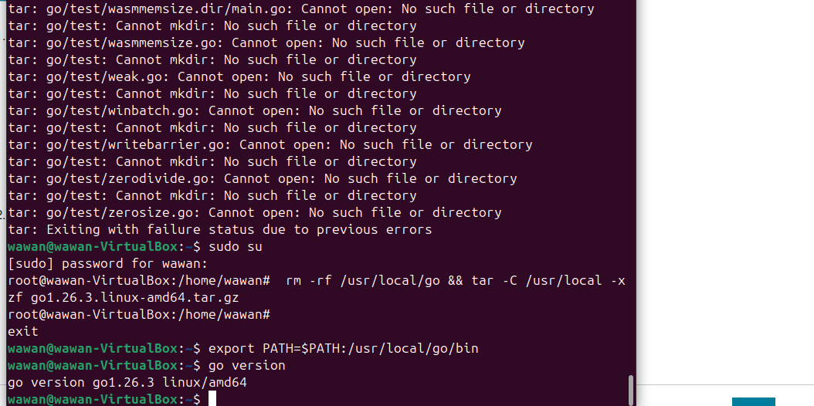
---

5. mkdir golang: membuat folder untuk golang
6. nano index.go: menambahkan code kepada file golang

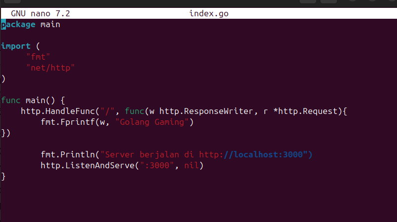
---

7. go run index.go: menjalankan file code golang
mengatifkan server sehingga dapat nyambung ke
port 3000 dan muncul di browser nama saya

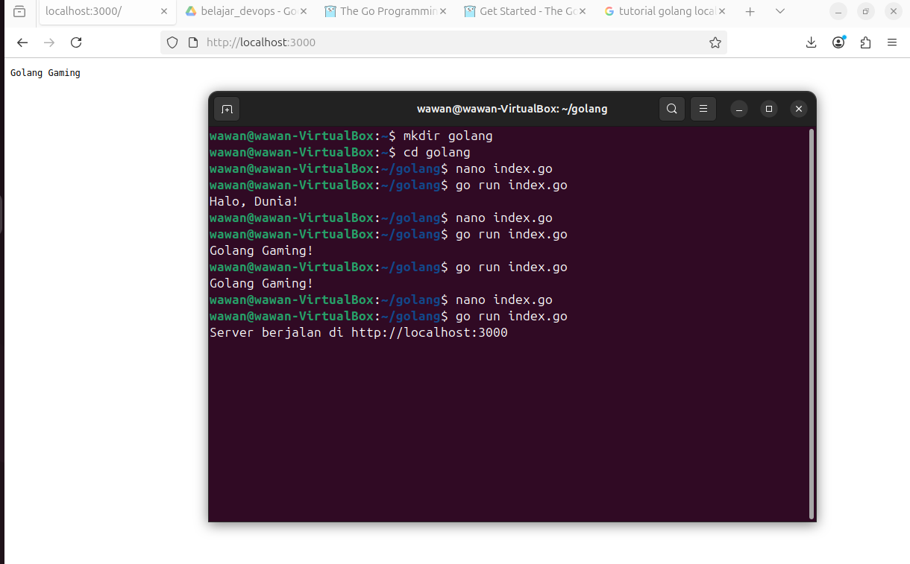
---

8. Terbukti port 3000 sudah terakses dengan UFW enabled

---
