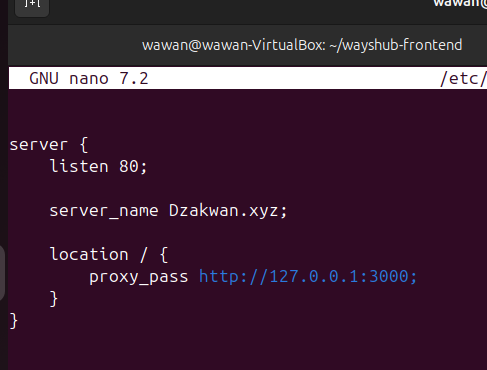
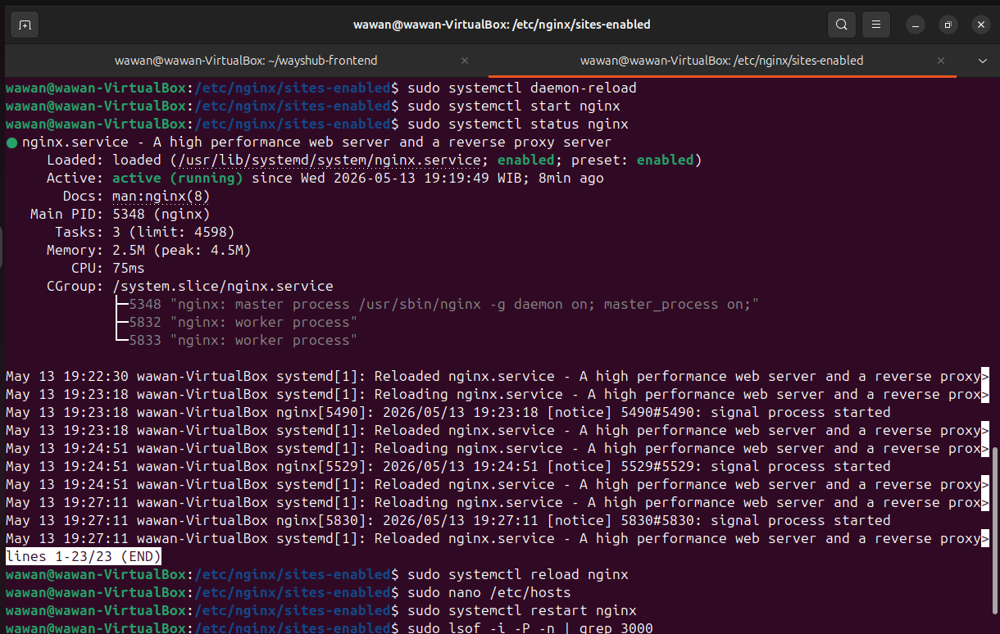
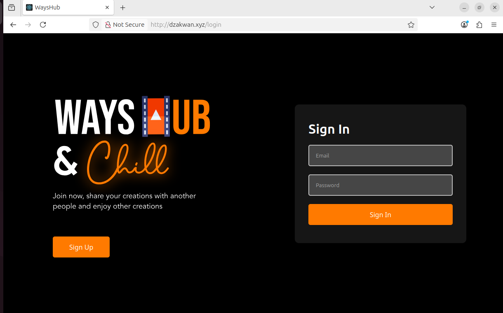

# DAY-6

STAGE-1
---------
Task Completion

# 1. Gambarkan struktur web server menggunakan reverse proxy dan jelaskan cara kerjanya!

---

Jadi menurut saya Reverse proxy itu bekerja sebagai perantara antara user/klien dengan server, jadi dia menerima permintaan user/klien lalu reverse proxy nya menentukan server terbaik untuk mengelola respon si klien tersebut. Setelah menerima permintaan, reverse proxynya memproses agar data dari user yang dikirimnya itu aman atau tidak dan menjaga
keamanan data user. Setelah itu, ia meneruskan permintaan user sampai server terbaik untuk di respon. Terakhir server merespon data user dari si reverse proxy, lalu mengirimkan kembali respon tersebut ke klien. 

# 2.  Reverse Proxy untuk aplilkasi yang sudah kalian deploy kemarin. (wayshub), untuk domain nya sesuaikan nama masing" ex: ade.xyz .

1. sudo nano ..... : Untuk menambahkan isi dile nginx web server
dengan code agar domainnya ama port yang dibuat bisa digunakan

2. sudo systemctl start nginx: memulai sistem web server nginx
3. suso systemctl status nginx: mengecek apakah berjalan tidak
web servernya
4. sudo systemctl reload nginx: mereload kembli ke file perubahan
web server terbaru.

---

5. npm start: menjalankan wayshub-frontend agar webnya
bisa dijalankan
6. Hasilnya saat Dzakwan.xyz di search maka hasilnya
akan muncul web wayshub-frontend dengan domain
Dzakwan.xyz

---

